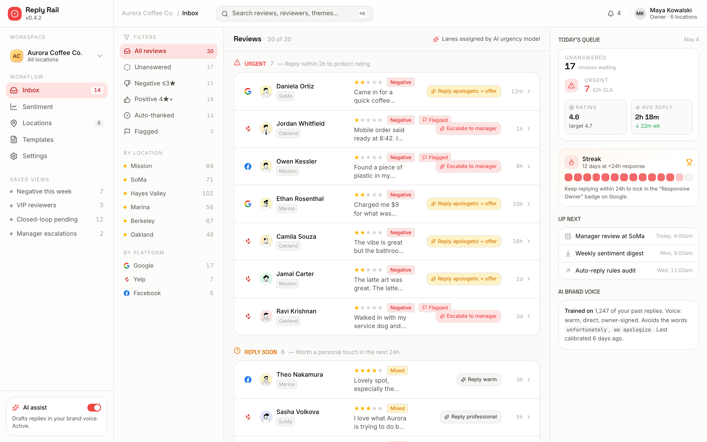
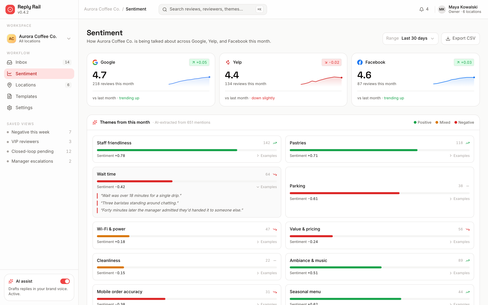
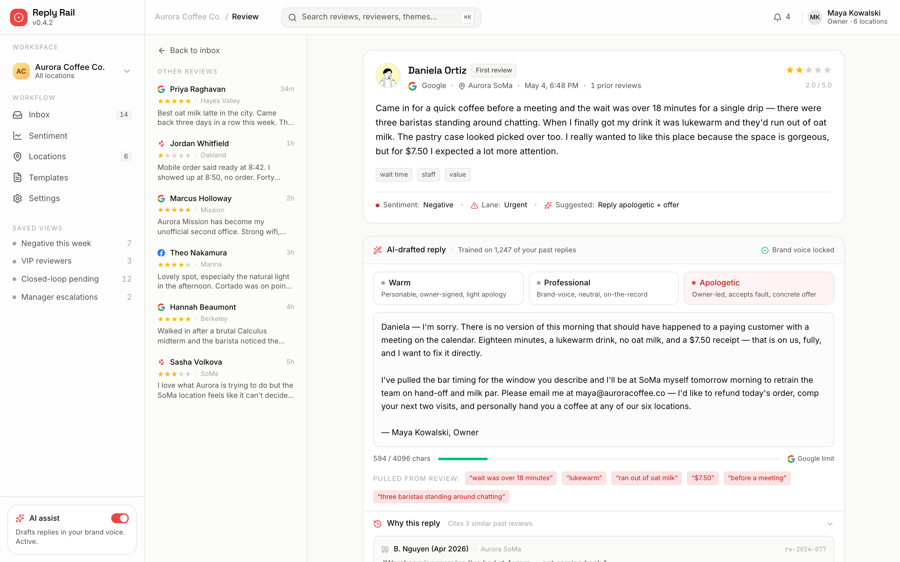

# Reply Rail

> AI-drafted review responses for local businesses — Google, Yelp, and Facebook in one queue.


Reply Rail is a triage workspace for the reviews piling up across every platform a multi-location business shows up on. Reviews land in one inbox, get grouped by AI-classified urgency lane, and the highest-stakes ones come pre-loaded with three tone-tunable drafted replies — each citing the past replies that worked.

The reference workspace is **Aurora Coffee Co.**, a six-location SF/East Bay cafe chain.

## Run locally

```bash
npm install
npm run dev
# open http://localhost:3004
```

Build:

```bash
npm run build
```

## Routes

| Path                | What it does                                                                 |
| ------------------- | ---------------------------------------------------------------------------- |
| `/`                 | Reviews inbox. Three-pane Gmail-like layout with filter rail, lane-grouped review list, and a today's-queue right rail. |
| `/review/[id]`      | Review detail with full review card, three-tone drafted reply, char counter against platform limits, and "Why this reply" citations. |
| `/sentiment`        | Sentiment dashboard. Per-platform rating cards with sparklines, AI-extracted theme chips, 12-week multi-line trend chart, and a per-location table. |

## Screenshots





## Notes

- Seed data lives in `src/data/` — six locations, thirty reviewers, thirty reviews spanning 1 to 5 stars, ten sentiment themes, and twelve weeks of weekly per-platform ratings.
- Avatars are pulled from DiceBear Notionists.
- Platform reply-length limits are enforced in the char-counter component (`src/data/draft.ts`).
- Dev server runs on **port 3004**.
